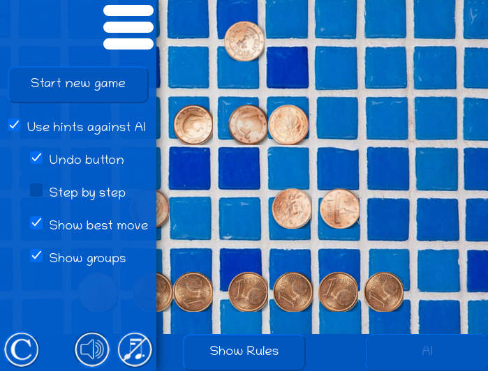

# Nim: a free-for-all of fighting functions

Your challenge is to create a JavaScript function that can play and beat functions created by other developers. In the case of a tie, the function that runs the fastest on average will win.

---
## What is Nim?
  
Nim is a game where you and your opponent take tokens (such as coins, marbles, matches, ...) from a set of tokens. In the classic version of the game, the tokens are arranged in four lines, with 1, 3, 5 and 7 tokens.

You may take one or more tokens from any line.

Nim is a _misere_ game: the player who takes the last token _loses the game_.

---
## Learning to Play

You can learn how to play Nim [here](https://withkoji.com/en/~blackslate/nim), or click on the image below to open the link.

[](https://withkoji.com/en/~blackslate/nim)

You can use the hamburger menu, and then select the different options in the Use Hints Against The AI section, to learn the winning strategy for the game.

Here's a clue: mentally divide each line of tokens up into groups of 4, 2 and 1. Remove the tokens that will leave even numbers of each kind of group.

If you want a(n almost) complete tutorial on how to write this game for in JavaScript, HTML and CSS, [here's one](https://blackslate.github.io/nim-tutorial/) that I wrote when my skills in these matters was not much better than yours could be now.

---
## The Challenge

1. Clone the Nim repo.
2. Modify the script at `Challenger/player.js`, following the instructions in the script
   * Your function should accept as an argument an array of four numbers. Each number will represent the number of tokens in a particular line. At the beginning of the game, the array will be `[1, 3, 5, 7]`. When the losing player is forced to take the last token, it might be `[0, 0, 1, 0]`, for example.
   * The value returned by your function should be a two-item object, like `{ take: 2, fromRow: 3 }`
3. When your function is ready, run the `index.js` script from the Terminal:
   ```bash
   node index.js
   ```
   You might see something like this in the Terminal:

   ```bash
   *******************************
   Round 1 of 4
   Player "Dr Nim" to start.
   *******************************  
   
   Dr Nim took 1 token from row 3:
         🪙 
       🪙🪙🪙 
     🪙🪙🪙🪙🪙 
   🪙🪙🪙🪙🪙🪙 · 
   Challenger failed to play a valid move. Dr Nim wins by forfeit.
   FIX YOUR CODE.
   ```

   Or you might see 4 complete rounds played out, ending with the final result:
   ```bash
   Wins:               { Challenger: 2, 'Dr Nim': 2 }
   Milliseconds taken: { Challenger: 1, 'Dr Nim': 1 }
   ```
4. Note that your function plays against the function exported by `Dr Nim/player.js`. To make it hard for you to copy this function, it has been [minified](https://www.imperva.com/learn/performance/minification/). If you want another tricky challenge, you could use an [unminifier tool](https://www.unminify2.com/) to format the code neatly, and then rename each of the variables and name the anonymous functions, in order to make sense of it. (The original script is available on request... but only to those who have already taken the challenge.)
5. When your `player` is working well, you can increase the number of games that it plays. In the `index.js` file, after the initial comments,you should see the following lines:

   ```javascript
   // You can decide how many games to play
   const GAMES_TO_PLAY = 2
   ```
   Try playing 250 games (500 rounds) or 5000, or, if you are winning no less than half the rounds, and you want to test if your code is fast enough, you can try 500000 games (1 million rounds).

   The output in the Terminal window will become more succinct if you play more rounds, so you can focus on the number of wins and the time taken. (You can edit the various `LOG_EACH...` constants at the beginning of `index.js` to change this behaviour, if you want.)

---
## Using Automated Tests
You can find a test suite in the `testing/` folder. To check if your function is giving good output for (a particular permutation of) every possible input, you can do the following:

1. Run the command `npm install` (One time only)
2. Run the command `npm test` after each improvement that you make.

**Note: the tests do not check on _every possible_ game state. For example: `[1, 2, 3, 4]` is tested but `[1, 2, 4, 3]`, `[1, 3, 2, 4]` and `[1, 3, 4, 2]` are not tested. Depending on how you write your function, it is possible that all the tests will pass, but that a different permutation of the same values might cause your function to play badly.**

---
## Bonus Challenge

The "Dr Nim" `player` can actually play _two_ versions of Nim:
1. The classic _misere_ version described above, where the player who takes the last token _loses_ the game
2. A "winner takes the last token" version, where the player who takes the last token _wins_.

To play the second version, you can simply set `winnerTakesLast` to `true` in `index.js`. Find the following lines...
```javascript
// Set winnerTakesLast to false to play the classic
// "misere" version of Nim. Change this to true for
// the Bonus Challenge.
const winnerTakesLast = false
```
... and set the last of these lines to:
```javascript
const winnerTakesLast = true
```

Your `player` function will now receive `true` as a second argument:

```javascript
const player = (stateOfPlay, winnerTakesLast) => {
  // Write your code to calculate the best move here
}
```

The "Dr Nim" `player` will automatically adapt the way it plays, so that it will continue to follow a winning strategy.

**Can you modify your `player.js` script so that it can win either game against Dr Nim, at least half the time?**

---
## Challenging Others
  
When you think your expert `player` is ready, you can share it with others who have accepted this challenge.

If you have any questions, don't hesitate to contact me on Slack.

Have fun!